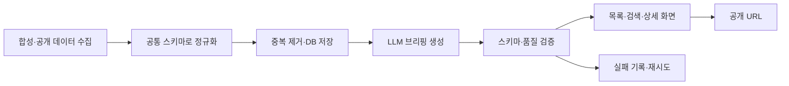
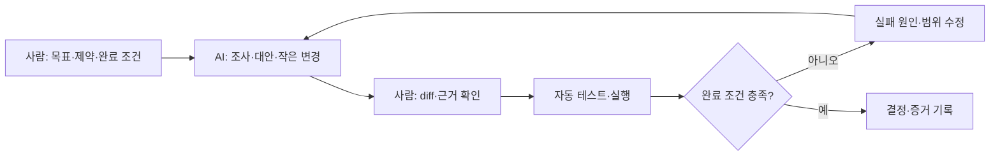

# AI 에이전트로 프로덕션 풀스택 출시하기

## 0. 강의 한 장 요약

> [!summary] 강의의 약속
> React·API·Git의 기초는 알지만 혼자 서비스를 끝까지 출시하지 못했던 개발자가, AI 에이전트의 역할과 검증 기준을 설계해 **작동하는 풀스택 서비스, 자동 테스트, 공개 URL, 운영 런북**까지 완성한다.

| 항목 | 설계안 |
|---|---|
| 권장 제목 | **AI 에이전트로 프로덕션 풀스택 출시하기** |
| 부제 | 부트캠프 다음 단계 - 기획·설계·개발·테스트·배포까지 AI를 팀처럼 쓰는 법 |
| 핵심 대상 | 부트캠프 수료생, 사이드 프로젝트가 미완성인 1~3년차 개발자 |
| 난이도 | 초급 후반~중급 |
| 예상 영상 | 약 6시간 40분 |
| 구성 | 9개 섹션, 41개 수업, 7개 미션 |
| 결과물 | `SignalDesk` 서비스, Git 저장소, 테스트 리포트, 배포 URL, 운영 런북 |
| 주 언어 | TypeScript |
| 주 스택 | Next.js, PostgreSQL, Prisma, Zod, Vitest, Playwright |
| AI 도구 | 화면 실습은 1개 도구, 방법론은 도구 중립적으로 설명 |

## 1. 강의 범위

### 수강 전 필요한 것

수강생은 아래 네 가지를 스스로 할 수 있어야 한다.

1. Git 저장소를 복제하고 브랜치·커밋을 만들 수 있다.
2. JavaScript/TypeScript의 함수, 객체, 배열, `async/await`를 이해한다.
3. React 컴포넌트와 HTTP API 호출 경험이 있다.
4. 터미널에서 패키지를 설치하고 개발 서버를 실행할 수 있다.

SQL, Next.js App Router, 테스트 경험은 있으면 좋지만 필수는 아니다. 강의에서 프로젝트에 필요한 범위만 설명한다.

### 이 강의에서 가르치지 않는 것

- HTML·CSS·JavaScript 문법 입문
- React·Next.js 전체 기능
- 프롬프트 엔지니어링 이론 총정리
- 로그인·OAuth·결제·구독
- Kubernetes, 대규모 분산 시스템, 고급 DevOps
- 모델 파인튜닝과 머신러닝 수학
- 특정 AI 도구의 모든 버튼과 명령어

이 범위를 추가하면 첫 강의가 지나치게 길어지고 “서비스를 출시한다”는 결과가 흐려진다. 인증·결제·RAG·멀티에이전트 자동화는 후속 강의로 분리한다.

## 2. 캡스톤 프로젝트: SignalDesk

`SignalDesk`는 공개 또는 강의용 합성 이벤트 데이터를 수집해 주제별 브리핑을 제공하는 웹 서비스다. 실제 운영 서비스의 핵심 구조는 배우되, 기존 Desk 제품의 코드·프롬프트·사업 로직은 사용하지 않는다.

### 핵심 사용자 흐름



### 최종 기능

- 이벤트 목록, 검색, 카테고리 필터, 상세 화면
- 합성 데이터 수집과 정규화
- 동일 이벤트 중복 방지
- LLM 기반 요약·핵심 포인트 생성
- 구조화 출력 검증과 실패 상태 저장
- `run_id`, `model_id`, `prompt_version` 기록
- mock 모드와 실제 API 모드 분리
- 단위·통합·E2E 테스트
- 배포 환경변수와 DB 마이그레이션
- 로그·오류·비용 확인용 최소 운영 화면

### 저장소 구조

```text
signal-desk/
├─ app/                  # Next.js 화면·Route Handler
├─ components/           # 화면 컴포넌트
├─ server/
│  ├─ ingest/            # 수집·정규화
│  ├─ analysis/          # LLM adapter·검증·fallback
│  └─ services/          # 핵심 유스케이스
├─ prisma/               # 스키마·마이그레이션
├─ contracts/            # Zod 요청·응답 계약
├─ tests/                # 단위·통합·E2E
├─ docs/                 # PRD·아키텍처·런북
├─ AGENTS.md              # AI 작업 규칙
└─ README.md
```

첫 버전은 모노레포나 별도 마이크로서비스로 분리하지 않는다. 하나의 저장소 안에서 경계를 명확히 만든 뒤, 후속 강의에서 worker나 Python API로 분리할 수 있게 설계한다.

## 3. 전체 커리큘럼

### 섹션 0. 완성 화면과 학습 방법 - 20분

| 수업 | 시간 | 핵심 내용 | 수강생 행동 |
|---|---:|---|---|
| 0-1. 이 강의가 해결하는 문제 | 5분 | AI로 코드는 만들지만 출시하지 못하는 이유 | 자신의 마지막 미완성 프로젝트 기록 |
| 0-2. SignalDesk 완성본 둘러보기 🔓 | 7분 | 목록·상세·분석·운영 화면, 테스트, 배포 결과 | 완성 기준 확인 |
| 0-3. AI가 할 일과 사람이 책임질 일 | 5분 | 생성·탐색과 결정·승인의 경계 | 승인 게이트 4개 확인 |
| 0-4. 비용·보안·실습 환경 | 3분 | mock 모드, API 비용 상한, 비밀정보 금지 | 로컬 환경 점검 |

> [!note] 미리보기 추천
> `0-2. SignalDesk 완성본 둘러보기`를 무료 미리보기로 공개한다. 강의의 기술 목록보다 수강 후 남는 결과를 먼저 보여 준다.

**섹션 산출물:** 개인 완성 기준표

---

### 섹션 1. 아이디어를 출시 가능한 범위로 줄이기 - 35분

| 수업 | 시간 | 핵심 내용 | 수강생 행동 |
|---|---:|---|---|
| 1-1. 기능보다 사용자 행동부터 정하기 | 8분 | 사용자·상황·문제·행동을 한 문장으로 정의 | 문제 문장 작성 |
| 1-2. AI와 아이디어를 검토하되 결정은 넘기지 않기 | 9분 | 대안 생성, 반례 요청, 가정 분리 | 아이디어 가정표 작성 |
| 1-3. 핵심 흐름 한 줄과 하지 않을 것 | 9분 | 세로 슬라이스, 범위 제한, 보류 목록 | MVP 범위 확정 |
| 1-4. 완료 조건이 있는 1페이지 PRD | 9분 | 기능·비기능 요구, 수용 기준, 실패 상태 | PRD 완성 |

#### 미션 1 - 1페이지 PRD

필수 항목:

- 대상 사용자 한 유형
- 핵심 문제 한 문장
- 사용자가 완료할 행동 한 개
- 핵심 기능 3개 이하
- 하지 않을 기능 5개 이상
- 성공·빈 결과·오류 상태의 완료 조건

**통과 기준:** 다른 사람이 3분 안에 만들 기능과 만들지 않을 기능을 구분할 수 있다.

---

### 섹션 2. AI 에이전트가 일할 환경 만들기 - 45분

| 수업 | 시간 | 핵심 내용 | 수강생 행동 |
|---|---:|---|---|
| 2-1. 프롬프트보다 컨텍스트가 먼저다 🔓 | 10분 | 장기 작업에서 정보 환경이 결과를 결정하는 이유 | 실패 사례 비교 |
| 2-2. 저장소 규칙과 금지사항 작성 | 9분 | 스택, 폴더 경계, 보안, 수정 금지 범위 | `AGENTS.md` 작성 |
| 2-3. 제품·설계·작업 문서 분리 | 9분 | `PRODUCT`, `ARCHITECTURE`, `TASKS`의 책임 | 문서 골격 생성 |
| 2-4. 역할을 나눠도 책임은 섞지 않기 | 9분 | 기획자·설계자·구현자·테스터·리뷰어 역할 | 역할별 입력·출력 정의 |
| 2-5. 작업을 작은 diff와 승인 게이트로 자르기 | 8분 | 한 작업 한 목표, 완료 증거, 중단 조건 | 첫 작업 티켓 작성 |

#### 미션 2 - AI 작업 컨텍스트 팩

제출물:

- `AGENTS.md`
- `docs/PRODUCT.md`
- `docs/ARCHITECTURE.md` 초안
- `docs/TASKS.md`
- AI가 해서는 안 되는 작업 5개

**통과 기준:** 새 AI 세션이 저장소를 읽고도 범위 밖 기능을 임의로 추가하지 않는다.

---

### 섹션 3. 코드보다 먼저 아키텍처와 계약 정하기 - 50분

| 수업 | 시간 | 핵심 내용 | 수강생 행동 |
|---|---:|---|---|
| 3-1. 사용자 흐름을 시스템 경계로 바꾸기 | 10분 | 화면·유스케이스·DB·외부 서비스의 책임 | 컨테이너 구조도 작성 |
| 3-2. 이벤트와 분석 결과 데이터 모델 | 10분 | 원본·정규화·분석·실행 이력 분리 | ERD 작성 |
| 3-3. Zod로 요청·응답 계약 만들기 | 10분 | 런타임 검증, 타입 공유, 오류 메시지 | 계약 스키마 작성 |
| 3-4. 정상보다 실패 계약을 먼저 정하기 | 10분 | 빈 결과, 중복, 타임아웃, 검증 실패 | 오류 표 작성 |
| 3-5. AI 설계안 검토: 근거·반례·복잡도 | 10분 | 과설계 탐지, 대안 비교, 결정 기록 | ADR 1개 작성 |

#### 미션 3 - 아키텍처 계약 패키지

제출물:

- 사용자 흐름도
- ERD
- API 요청·응답 Zod 스키마
- 오류·빈 결과·중복 처리표
- 선택한 구조와 버린 대안을 기록한 ADR

**통과 기준:** 화면 구현 전에도 입력·저장·출력·실패 경로를 설명할 수 있다.

---

### 섹션 4. 세로 한 줄을 먼저 동작시키기 - 65분

| 수업 | 시간 | 핵심 내용 | 수강생 행동 |
|---|---:|---|---|
| 4-1. 시작 저장소와 기준선 테스트 | 8분 | 초기 구조, 실행 명령, baseline | 테스트 결과 저장 |
| 4-2. Prisma 스키마와 첫 마이그레이션 | 11분 | Event·Brief·AnalysisRun 모델 | 로컬 DB 생성 |
| 4-3. 합성 이벤트 수집·정규화 | 11분 | adapter, 원본 보존, 공통 스키마 | 첫 이벤트 저장 |
| 4-4. 목록 API와 화면 연결 | 12분 | 서비스 계층, Route Handler, loading·empty·error | 목록 화면 완성 |
| 4-5. 상세 API와 상세 화면 연결 | 12분 | 식별자, not-found, 데이터 경계 | 상세 화면 완성 |
| 4-6. 첫 diff를 테스트하고 리뷰하기 | 11분 | 범위 밖 변경, 중복 코드, 회귀 확인 | 첫 수직 슬라이스 승인 |

#### 미션 4 - 작동하는 첫 수직 슬라이스

필수 시나리오:

1. 합성 이벤트 10개를 수집한다.
2. DB에 중복 없이 저장한다.
3. 목록에서 항목을 선택한다.
4. 상세 정보를 확인한다.
5. 데이터가 없거나 ID가 틀릴 때 올바른 상태를 보여 준다.

**통과 기준:** 아직 AI 분석이 없어도 사용자 흐름 전체가 작동한다.

---

### 섹션 5. AI 분석을 신뢰 가능한 기능으로 만들기 - 60분

| 수업 | 시간 | 핵심 내용 | 수강생 행동 |
|---|---:|---|---|
| 5-1. LLM 호출을 비즈니스 로직에서 분리 | 11분 | provider adapter, 입력·출력 경계 | mock·real adapter 분리 |
| 5-2. 구조화 출력과 스키마 검증 | 12분 | 요약·핵심 포인트·신뢰 표시, parse 실패 | 검증 가능한 응답 생성 |
| 5-3. 실행 이력과 재현성 확보 | 12분 | `run_id`, 모델, 프롬프트 버전, 시간·비용 | AnalysisRun 저장 |
| 5-4. 타임아웃·재시도·fallback·중복 방지 | 13분 | 재시도 가능 오류, 영구 실패, 멱등성 | 실패 정책 구현 |
| 5-5. 실패를 일부러 만들어 복구 확인 🔓 | 12분 | 잘린 JSON, 지연, 빈 응답, 비용 상한 | 장애 주입 실습 |

> [!note] 미리보기 추천
> `5-5. 실패를 일부러 만들어 복구 확인`을 두 번째 미리보기로 공개한다. 범용 AI 코딩 강의와 다른 “검증·운영” 차별점을 가장 잘 보여 준다.

#### 미션 5 - 고장 나도 설명 가능한 AI 기능

아래 실패를 자동 테스트한다.

- 유효하지 않은 JSON
- 필수 필드 누락
- 응답 지연·타임아웃
- 동일 이벤트 중복 분석 요청
- mock 모드에서 API 키 없음
- 정한 호출 횟수 또는 비용 상한 초과

**통과 기준:** 실패가 조용히 사라지거나 잘못된 성공으로 저장되지 않는다.

---

### 섹션 6. AI가 만든 코드를 테스트하고 거절하는 법 - 55분

| 수업 | 시간 | 핵심 내용 | 수강생 행동 |
|---|---:|---|---|
| 6-1. 위험 기반 테스트 범위 정하기 | 10분 | 모든 코드를 테스트하지 않고 계약·비용·데이터를 우선 | 테스트 매트릭스 작성 |
| 6-2. 수집·정규화 단위 테스트 | 11분 | 원본 보존, 날짜·카테고리 변환, 중복 | 단위 테스트 작성 |
| 6-3. DB·API 통합 테스트 | 11분 | 실제 저장, 트랜잭션, 상태 코드·응답 계약 | 통합 테스트 작성 |
| 6-4. 핵심 사용자 흐름 E2E 테스트 | 11분 | 목록→검색→상세→분석 상태 | Playwright 시나리오 작성 |
| 6-5. AI 코드리뷰 체크리스트 | 12분 | 가짜 API, 미사용 코드, 보안, 과설계, 테스트 회피 | AI 변경 승인·거절 |

#### 미션 6 - 출시 품질 게이트

제출물:

- 위험 기반 테스트 매트릭스
- 단위·통합·E2E 테스트 각 1개 이상
- 실패한 테스트를 고친 diff
- AI 제안을 거절한 사례와 이유 1개

**통과 기준:** “AI가 된다고 말했다”가 아니라 자동 실행 결과와 근거 diff가 남는다.

---

### 섹션 7. 배포하고 운영 가능한 상태로 만들기 - 45분

| 수업 | 시간 | 핵심 내용 | 수강생 행동 |
|---|---:|---|---|
| 7-1. 개발·검증·운영 환경 분리 | 10분 | 환경변수, 비밀, mock/real, 설정 검증 | 환경 표 작성 |
| 7-2. DB 마이그레이션과 배포 | 12분 | 배포 순서, 마이그레이션, seed, 롤백 | 공개 환경 배포 |
| 7-3. 구조화 로그와 최소 운영 화면 | 12분 | 실행 이력, 실패 원인, 최근 상태, 비용 확인 | 운영 화면 완성 |
| 7-4. 장애 대응·롤백·운영 런북 | 11분 | 확인 순서, 중지 조건, 복구·재배포 | 런북 작성 |

#### 미션 7 - 공개 URL과 운영 런북

필수 증거:

- 공개 URL
- 배포된 커밋 해시
- 실행 가능한 README
- 환경변수 목록과 비밀 제외 확인
- 최근 작업 성공·실패 상태 화면
- 장애 3종에 대한 확인·복구 순서

**통과 기준:** 강사가 없는 환경에서도 다른 사람이 서비스를 실행하고 문제를 확인할 수 있다.

---

### 섹션 8. 출시 증거를 남기고 다음 버전을 결정하기 - 25분

| 수업 | 시간 | 핵심 내용 | 수강생 행동 |
|---|---:|---|---|
| 8-1. 기능 목록이 아닌 출시 증거 정리 | 8분 | URL, 사용자 흐름, 테스트, 결정·실패 기록 | Release Evidence 작성 |
| 8-2. 포트폴리오 사례로 바꾸기 | 9분 | 문제→제약→결정→검증→결과 서술 | 프로젝트 소개 작성 |
| 8-3. 다음 기능보다 다음 검증 정하기 | 8분 | 사용자 반응, 운영비, 오류, 유지·중단 기준 | 2주 운영 계획 작성 |

**최종 제출물:**

```text
1. 공개 서비스 URL
2. Git 저장소 URL
3. 1페이지 PRD
4. 아키텍처와 ADR
5. 자동 테스트 결과
6. AI 실행·실패 이력 화면
7. 운영 런북
8. 포트폴리오용 프로젝트 설명
```

## 4. 수업에서 반복할 공통 진행 방식

모든 구현 수업을 같은 리듬으로 구성한다.



한 수업의 화면 구성:

1. 오늘 끝낼 결과 20초
2. 현재 코드와 제약 1분
3. AI에게 줄 작업 지시 1~2분
4. 제안·diff에서 확인할 부분 3~5분
5. 테스트·실행 2~3분
6. 잘못된 접근과 거절 이유 1분
7. 저장할 산출물과 다음 수업 연결 30초

AI가 긴 시간 코드를 생성하는 화면은 편집하고, 판단·실패·수정 장면은 남긴다.

## 5. 완료 기준과 자기평가

총 100점의 자기평가표를 제공한다. 점수가 목적이 아니라 빠뜨린 출시 조건을 찾기 위한 장치다.

| 영역 | 배점 | 통과 조건 |
|---|---:|---|
| 문제·범위 | 10 | 사용자·핵심 행동·보류 기능이 명확함 |
| AI 컨텍스트 | 10 | 규칙·금지·완료 조건이 저장소에 있음 |
| 구조·계약 | 15 | ERD·API·오류 계약이 코드와 일치함 |
| 핵심 사용자 흐름 | 15 | 수집→목록→상세→분석이 연결됨 |
| AI 신뢰성 | 15 | 구조화 검증·이력·재시도·중복 방지가 있음 |
| 테스트 | 15 | 단위·통합·E2E와 실패 사례가 있음 |
| 배포·운영 | 15 | 공개 URL·로그·런북·롤백 방법이 있음 |
| 설명 가능성 | 5 | 결정과 거절한 대안을 설명할 수 있음 |

**완강 기준:** 80점 이상이면서 공개 URL, 핵심 E2E 테스트, 운영 런북 세 항목을 모두 충족한다.

## 6. 강의 자료 패키지

### 코드

- `00-starter`: 실행만 되는 시작 저장소
- `01-contracts`: 데이터·API 계약 완료
- `02-vertical-slice`: 수집→목록→상세 완료
- `03-ai-analysis`: mock·real AI adapter 완료
- `04-quality-gates`: 테스트·리뷰 완료
- `05-production`: 배포·운영 완료

수강생이 정답을 복사하지 않도록 각 태그에는 이전 단계 대비 diff 설명을 함께 제공한다.

### 템플릿

- `ONE_PAGE_PRD.md`
- `AGENTS_TEMPLATE.md`
- `ARCHITECTURE_TEMPLATE.md`
- `TASK_TEMPLATE.md`
- `ADR_TEMPLATE.md`
- `API_ERROR_CONTRACT.md`
- `TEST_MATRIX.md`
- `AI_REVIEW_CHECKLIST.md`
- `DEPLOY_CHECKLIST.md`
- `RUNBOOK_TEMPLATE.md`
- `RELEASE_EVIDENCE.md`

### 실습 데이터

- 정상 이벤트 30개
- 중복 이벤트 5개
- 날짜·카테고리 오류 이벤트 5개
- LLM 정상 응답 fixture
- 잘린 JSON, 빈 응답, 필드 누락 fixture
- 타임아웃과 재시도 시뮬레이터

API 키 없이 모든 핵심 실습이 가능해야 한다. 실제 AI API는 선택 실습이며 비용 상한과 삭제 방법을 안내한다.

## 7. 파일럿 운영안

### 정식 녹화 전에 만들 것

1. 완성 화면 데모 7분
2. `2-1. 프롬프트보다 컨텍스트가 먼저다` 10분
3. `5-5. 실패를 일부러 만들어 복구 확인` 12분
4. 미션 1과 미션 5 자료
5. 시작 저장소와 완성 저장소

이 세 수업만으로 파일럿 대상자가 아래 질문에 답할 수 있어야 한다.

- 이 강의는 일반 AI 도구 강의와 무엇이 다른가?
- 수강 후 어떤 증거가 남는가?
- 현재 내 실력으로 따라갈 수 있는가?

### 베타 수강생 5명에게 확인할 것

- 개발 환경 설정에 걸린 시간
- 각 미션에서 처음 막힌 지점
- AI 지시보다 검증 과정이 이해됐는지
- 6시간대 강의에서 삭제해도 되는 내용
- 실제로 공개 URL까지 만든 인원
- 강사 도움 없이 README로 복구 가능한지

### 베타 통과 기준

- 5명 중 4명 이상이 첫 수직 슬라이스 완료
- 5명 중 3명 이상이 공개 URL과 E2E 테스트 완료
- 같은 환경 오류가 2명 이상에게 반복되지 않음
- “Next.js 입문 설명이 부족하다”가 다수 의견이면 강의를 늘리지 않고 선수학습 자료를 별도 제공

## 8. 강의가 커지는 것을 막는 삭제 원칙

아래 요청이 나오면 본편에 바로 추가하지 않는다.

| 요청 | 처리 |
|---|---|
| 로그인·OAuth | 후속 강의 또는 보너스 문서 |
| 결제·구독 | 수요 검증 후 별도 강의 |
| Python·FastAPI 분리 | AI 파이프라인 심화편 |
| RAG·벡터 검색 | 데이터·검색 심화편 |
| 멀티에이전트 완전 자동화 | 운영 경험 축적 후 심화편 |
| Docker·Kubernetes | 배포 심화편 |
| HTML·React 기초 | 무료 선수학습 로드맵 |
| 취업용 이력서 첨삭 | 멘토링 상품 |

첫 강의는 기능의 폭이 아니라 **출시 전 과정을 한 번 끝내는 깊이**로 차별화한다.

## 9. 강의 소개 페이지용 학습 결과

### 이 강의를 마치면 할 수 있는 것

- 아이디어를 AI에게 던지기 전에 출시 가능한 1페이지 PRD로 줄일 수 있다.
- AI 에이전트에게 프로젝트 규칙·금지사항·완료 조건을 지속적으로 제공할 수 있다.
- 화면·API·DB·AI 분석의 경계를 정하고 계약부터 구현할 수 있다.
- AI가 만든 코드를 diff·테스트·실행 결과로 승인하거나 거절할 수 있다.
- LLM의 잘린 응답·타임아웃·중복 요청을 실패 상태로 다룰 수 있다.
- 공개 URL, 테스트, 실행 이력, 운영 런북이 있는 서비스를 출시할 수 있다.

### 강의 한 줄 카피 후보

1. **AI가 코드를 만들게 하지 말고, 서비스가 출시되게 만드세요.**
2. **프롬프트에서 끝나지 않는 AI 풀스택 개발.**
3. **기획부터 운영 증거까지, AI를 팀처럼 쓰는 6시간 40분.**
4. **CRUD 데모를 공개 가능한 서비스로 바꾸는 마지막 단계.**

> [!important] 다음 제작 순서
> `SignalDesk` 완성 저장소를 먼저 만들고, 그 과정에서 실제로 필요한 문서·테스트·실패 사례를 역순으로 커리큘럼에 배치한다. 커리큘럼을 먼저 촬영한 뒤 코드를 맞추지 않는다. 완성본 데모, 컨텍스트 수업, 실패 복구 수업의 3개 파일럿 영상이 검증된 뒤 본편을 녹화한다.
